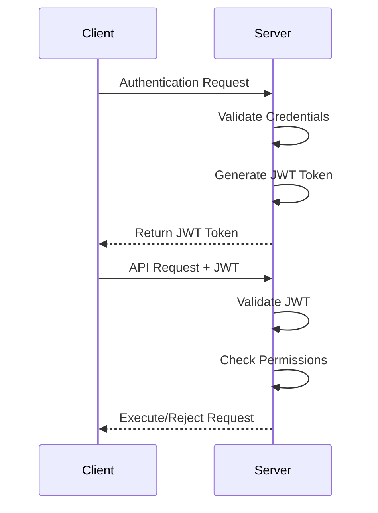

# System Controller Security Documentation

This document provides comprehensive security information for the System Controller application, including security features, best practices, and deployment recommendations.

## Table of Contents

- [Security Overview](#security-overview)
- [Authentication & Authorization](#authentication--authorization)
- [Encryption & Transport Security](#encryption--transport-security)
- [Rate Limiting & DoS Protection](#rate-limiting--dos-protection)
- [Audit Logging & Monitoring](#audit-logging--monitoring)
- [Secure Deployment](#secure-deployment)
- [Security Configuration](#security-configuration)
- [Vulnerability Management](#vulnerability-management)
- [Incident Response](#incident-response)
- [Compliance & Standards](#compliance--standards)

## Security Overview

The System Controller implements defense-in-depth security principles with multiple layers of protection:

### Security Architecture

```
┌─────────────────────────────────────────────────┐
│                  Client Layer                   │
├─────────────────────────────────────────────────┤
│            TLS 1.3 Encryption                   │
├─────────────────────────────────────────────────┤
│        Authentication & Authorization           │
├─────────────────────────────────────────────────┤
│          Rate Limiting & Validation             │
├─────────────────────────────────────────────────┤
│            Application Security                 │
├─────────────────────────────────────────────────┤
│         Audit Logging & Monitoring             │
├─────────────────────────────────────────────────┤
│          Platform Security Layer               │
└─────────────────────────────────────────────────┘
```

### Core Security Features

- **🔐 End-to-End Encryption**: TLS 1.3 for all communications
- **🎫 JWT Authentication**: Token-based authentication with configurable expiration
- **🛡️ Role-Based Access Control**: Granular permissions and authorization
- **⚡ Rate Limiting**: Configurable rate limits and resource protection
- **📊 Comprehensive Auditing**: Security event logging and monitoring
- **🔍 Input Validation**: All commands validated and sanitized
- **🚫 DoS Protection**: Multiple layers of denial-of-service protection
- **🔒 Secure Defaults**: Security-first configuration out of the box

## Authentication & Authorization

### Authentication Methods

#### 1. JWT Token Authentication

**Primary authentication method using JSON Web Tokens:**

```json
{
  "id": "auth-001",
  "type": "authenticate",
  "payload": {
    "username": "admin",
    "password": "secure-password"
  },
  "timestamp": "2024-01-15T10:30:00Z"
}
```

**Token Response:**
```json
{
  "command_id": "auth-001",
  "status": "success",
  "data": {
    "type": "auth_success",
    "token": "eyJ0eXAiOiJKV1QiLCJhbGciOiJIUzI1NiJ9...",
    "expires_at": "2024-01-15T11:30:00Z",
    "permissions": ["input_control", "screen_capture"]
  }
}
```

#### 2. API Key Authentication (Future)

For automated systems and service accounts:

```bash
# Using API key in header
curl -H "X-API-Key: your-api-key" https://localhost:8080/api/status
```

### User Management

#### Creating Secure Users

```bash
# Using the management API
curl -X POST https://localhost:8080/api/users \
  -H "Authorization: Bearer $ADMIN_TOKEN" \
  -H "Content-Type: application/json" \
  -d '{
    "username": "operator",
    "password": "ComplexPassword123!@#",
    "permissions": ["input_control"],
    "expires_at": "2024-12-31T23:59:59Z"
  }'
```

#### Password Requirements

Default password policy (configurable):
- **Minimum Length**: 12 characters
- **Complexity**: Must contain uppercase, lowercase, numbers, and symbols
- **History**: Cannot reuse last 5 passwords
- **Expiration**: 90 days (configurable)
- **Lockout**: Account locked after 5 failed attempts

### Permission System

#### Available Permissions

| Permission | Description | Risk Level |
|------------|-------------|------------|
| `input_control` | Mouse and keyboard control | High |
| `screen_capture` | Screen capture and streaming | Medium |
| `window_management` | Window information access | Low |
| `system_info` | System information access | Low |
| `user_management` | Create/modify users | Critical |
| `admin` | Full administrative access | Critical |

#### Permission Groups

Pre-defined permission groups for common use cases:

```json
{
  "groups": {
    "viewer": ["screen_capture", "window_management", "system_info"],
    "operator": ["input_control", "screen_capture", "window_management"],
    "administrator": ["admin"]
  }
}
```

### Authorization Flow



## Encryption & Transport Security

### TLS Configuration

#### Supported TLS Versions
- **TLS 1.3**: Preferred (faster, more secure)
- **TLS 1.2**: Supported for compatibility
- **TLS 1.1 and below**: Disabled by default

#### Cipher Suites (TLS 1.3)
- `TLS_AES_256_GCM_SHA384`
- `TLS_CHACHA20_POLY1305_SHA256`
- `TLS_AES_128_GCM_SHA256`

#### Certificate Management

**Generate Production Certificates:**
```bash
# Using Let's Encrypt
sudo certbot certonly --standalone -d your-domain.com

# Using self-signed (development only)
openssl req -x509 -newkey rsa:4096 -keyout key.pem -out cert.pem -days 365 -nodes
```

**Certificate Validation:**
```bash
# Verify certificate
openssl x509 -in cert.pem -text -noout

# Test TLS connection
openssl s_client -connect localhost:8080 -tls1_3
```

### Data Encryption

#### At Rest
- **Configuration**: Sensitive config values encrypted with AES-256
- **Logs**: Audit logs can be encrypted (optional)
- **Certificates**: Private keys protected with filesystem permissions

#### In Transit
- **TLS 1.3**: All network communications encrypted
- **Perfect Forward Secrecy**: Ephemeral key exchange
- **Certificate Pinning**: Optional for high-security environments

### Cryptographic Standards

- **Hashing**: SHA-256, SHA-384, PBKDF2, Argon2
- **Symmetric**: AES-256-GCM, ChaCha20-Poly1305
- **Asymmetric**: RSA-4096, ECDSA P-256/P-384
- **Random**: Cryptographically secure random number generation

## Rate Limiting & DoS Protection

### Multi-Layer Rate Limiting

#### 1. Connection-Level Limiting
```toml
[security.rate_limiting.connection]
max_connections_per_ip = 10
max_connections_total = 1000
connection_timeout_seconds = 300
```

#### 2. Authentication Rate Limiting
```toml
[security.rate_limiting.authentication]
max_attempts_per_ip = 5
lockout_duration_minutes = 15
max_attempts_per_user = 3
user_lockout_duration_minutes = 30
```

#### 3. Command Rate Limiting
```toml
[security.rate_limiting.commands]
max_commands_per_second = 100
max_commands_per_minute = 1000
burst_allowance = 10
```

#### 4. Resource-Based Limiting
```toml
[security.rate_limiting.resources]
max_screen_captures_per_minute = 60
max_data_transfer_mb_per_minute = 100
max_concurrent_streams = 5
```

### DDoS Protection

#### Application-Level Protection
- **Request Validation**: All inputs validated before processing
- **Memory Limits**: Bounded memory usage per connection
- **CPU Throttling**: CPU usage monitoring and limiting
- **Connection Pooling**: Efficient resource management

#### Network-Level Recommendations
```bash
# iptables rules for DDoS protection
sudo iptables -A INPUT -p tcp --dport 8080 -m connlimit --connlimit-above 10 -j DROP
sudo iptables -A INPUT -p tcp --dport 8080 -m recent --name badactors --rcheck --seconds 60 --hitcount 10 -j DROP
```

## Audit Logging & Monitoring

### Audit Events

#### Security Events
- Authentication attempts (success/failure)
- Authorization failures
- Rate limit violations
- Configuration changes
- User management operations
- Privilege escalations

#### Operational Events
- Connection establishment/termination
- Command execution
- Resource access
- Error conditions
- Performance anomalies

### Log Format

#### Structured JSON Logging
```json
{
  "timestamp": "2024-01-15T10:30:00.123Z",
  "level": "WARN",
  "event_type": "authentication_failure",
  "user": "admin",
  "source_ip": "192.168.1.100",
  "session_id": "sess_123456",
  "details": {
    "reason": "invalid_password",
    "attempt_count": 3,
    "lockout_triggered": false
  },
  "trace_id": "trace_789012"
}
```

#### Security Event Categories
- **CRITICAL**: Security breaches, privilege escalation
- **HIGH**: Authentication failures, authorization violations
- **MEDIUM**: Rate limiting, suspicious activity
- **LOW**: Normal operations, informational

### Log Management

#### Configuration
```toml
[logging.audit]
enabled = true
log_file = "/var/log/system-controller/audit.log"
max_file_size_mb = 100
max_files = 10
encrypt_logs = true
syslog_enabled = true
syslog_facility = "auth"
```

#### Log Rotation
```bash
# Logrotate configuration
cat > /etc/logrotate.d/system-controller << EOF
/var/log/system-controller/*.log {
    daily
    rotate 30
    compress
    delaycompress
    missingok
    notifempty
    create 640 system-controller system-controller
    postrotate
        systemctl reload system-controller
    endscript
}
EOF
```

### Security Monitoring

#### Real-Time Alerts

**Failed Authentication Attempts:**
```bash
# Monitor for multiple failed logins
tail -f /var/log/system-controller/audit.log | \
  grep "authentication_failure" | \
  while read line; do
    # Alert on 5 failures in 5 minutes
    # Implementation depends on your monitoring system
  done
```

**Suspicious Activity Patterns:**
- Multiple failed authentications from single IP
- Unusual command patterns or frequency
- Access from unexpected geographic locations
- Commands executed outside business hours

#### Integration with SIEM Systems

**Splunk Integration:**
```bash
# Splunk forwarder configuration
[monitor:///var/log/system-controller/audit.log]
sourcetype = system_controller_audit
index = security
```

**ELK Stack Integration:**
```yaml
# Filebeat configuration
filebeat.inputs:
- type: log
  paths:
    - /var/log/system-controller/audit.log
  json.keys_under_root: true
  json.add_error_key: true
  fields:
    service: system-controller
    environment: production
```

## Secure Deployment

### Network Security

#### Firewall Configuration

**Restrictive Firewall Rules:**
```bash
# Only allow specific IPs
sudo ufw deny 8080
sudo ufw allow from 192.168.1.0/24 to any port 8080
sudo ufw allow from 10.0.0.0/8 to any port 8080

# Log denied connections
sudo ufw logging on
```

#### Network Segmentation
- **DMZ Deployment**: Place in DMZ with restricted network access
- **VPN Access**: Require VPN connection for remote access
- **Jump Box**: Use bastion hosts for administrative access

### Operating System Security

#### File Permissions
```bash
# Secure file permissions
sudo chown -R system-controller:system-controller /opt/system-controller/
sudo chmod 755 /opt/system-controller/bin/system-controller
sudo chmod 600 /opt/system-controller/config/*.toml
sudo chmod 600 /opt/system-controller/certs/*
```

#### System Hardening
```bash
# Disable unused services
sudo systemctl disable telnet
sudo systemctl disable ftp
sudo systemctl disable rsh

# Enable automatic security updates
sudo apt install unattended-upgrades
sudo dpkg-reconfigure unattended-upgrades
```

### Container Security

#### Secure Docker Configuration

**Dockerfile Security:**
```dockerfile
# Use minimal base image
FROM debian:bullseye-slim

# Create non-root user
RUN groupadd -r system-controller && \
    useradd -r -g system-controller system-controller

# Set secure permissions
COPY --chown=system-controller:system-controller ./system-controller /usr/local/bin/
RUN chmod +x /usr/local/bin/system-controller

# Use non-root user
USER system-controller

# Drop capabilities
RUN setcap 'cap_net_bind_service=+ep' /usr/local/bin/system-controller
```

**Docker Compose Security:**
```yaml
version: '3.8'
services:
  system-controller:
    image: system-controller:latest
    user: "1000:1000"
    cap_drop:
      - ALL
    cap_add:
      - NET_BIND_SERVICE
    security_opt:
      - no-new-privileges:true
    read_only: true
    tmpfs:
      - /tmp:noexec,nosuid,size=100m
```

### Kubernetes Security

**Security Context:**
```yaml
apiVersion: v1
kind: Pod
spec:
  securityContext:
    runAsNonRoot: true
    runAsUser: 1000
    runAsGroup: 1000
    fsGroup: 1000
  containers:
  - name: system-controller
    securityContext:
      allowPrivilegeEscalation: false
      readOnlyRootFilesystem: true
      capabilities:
        drop:
        - ALL
        add:
        - NET_BIND_SERVICE
```

**Network Policies:**
```yaml
apiVersion: networking.k8s.io/v1
kind: NetworkPolicy
metadata:
  name: system-controller-netpol
spec:
  podSelector:
    matchLabels:
      app: system-controller
  policyTypes:
  - Ingress
  - Egress
  ingress:
  - from:
    - namespaceSelector:
        matchLabels:
          name: management
    ports:
    - protocol: TCP
      port: 8080
```

## Security Configuration

### Environment Variables

**Security-Critical Environment Variables:**
```bash
# Authentication
export SYSTEM_CONTROLLER_JWT_SECRET=$(openssl rand -hex 32)
export SYSTEM_CONTROLLER_JWT_EXPIRATION=3600
export SYSTEM_CONTROLLER_PASSWORD_MIN_LENGTH=12

# TLS Configuration
export SYSTEM_CONTROLLER_TLS_CERT="/path/to/cert.pem"
export SYSTEM_CONTROLLER_TLS_KEY="/path/to/key.pem"
export SYSTEM_CONTROLLER_TLS_MIN_VERSION="1.2"

# Rate Limiting
export SYSTEM_CONTROLLER_RATE_LIMIT=100
export SYSTEM_CONTROLLER_MAX_CONNECTIONS=500
export SYSTEM_CONTROLLER_CONNECTION_TIMEOUT=300

# Security Features
export SYSTEM_CONTROLLER_ENABLE_AUDIT_LOG=true
export SYSTEM_CONTROLLER_SECURITY_HEADERS=true
export SYSTEM_CONTROLLER_CORS_ENABLED=false
```

### Configuration File Security

**Secure Configuration (config.toml):**
```toml
[security]
# Authentication
jwt_secret_file = "/etc/system-controller/jwt.secret"  # Don't store in config
jwt_expiration_seconds = 3600
password_policy.min_length = 12
password_policy.require_complexity = true
failed_login_lockout_attempts = 5
failed_login_lockout_duration_minutes = 15

# TLS Configuration
tls.cert_file = "/etc/ssl/certs/system-controller.pem"
tls.key_file = "/etc/ssl/private/system-controller.key"
tls.min_version = "1.2"
tls.cipher_suites = ["TLS_AES_256_GCM_SHA384", "TLS_CHACHA20_POLY1305_SHA256"]

# Security Headers
security_headers.enable = true
security_headers.hsts_max_age = 31536000
security_headers.content_type_nosniff = true
security_headers.frame_options = "DENY"

# Rate Limiting
rate_limiting.enable = true
rate_limiting.commands_per_second = 100
rate_limiting.connections_per_ip = 10
rate_limiting.auth_attempts_per_ip = 5

# Audit Logging
audit.enable = true
audit.log_file = "/var/log/system-controller/audit.log"
audit.log_level = "info"
audit.log_all_commands = true
audit.log_sensitive_data = false
```

### Secrets Management

#### Using HashiCorp Vault

```bash
# Store JWT secret in Vault
vault kv put secret/system-controller jwt_secret="$(openssl rand -hex 32)"

# Retrieve secret in application
export SYSTEM_CONTROLLER_JWT_SECRET=$(vault kv get -field=jwt_secret secret/system-controller)
```

#### Using Kubernetes Secrets

```yaml
apiVersion: v1
kind: Secret
metadata:
  name: system-controller-secrets
type: Opaque
data:
  jwt-secret: <base64-encoded-secret>
  tls-cert: <base64-encoded-cert>
  tls-key: <base64-encoded-key>
```

## Vulnerability Management

### Security Update Process

#### 1. Dependency Scanning
```bash
# Rust security audit
cargo audit

# Generate security report
cargo audit --json > security-audit.json
```

#### 2. OWASP Dependency Check
```bash
# Install dependency-check
wget https://github.com/jeremylong/DependencyCheck/releases/download/v7.3.0/dependency-check-7.3.0-release.zip

# Run scan
./dependency-check/bin/dependency-check.sh --project "System Controller" --scan target/
```

#### 3. Static Code Analysis
```bash
# Clippy security lints
cargo clippy -- -W clippy::security

# Third-party security scanners
semgrep --config=security .
```

### Known Vulnerabilities

#### CVE Tracking
- Monitor Rust Security Advisory Database
- Subscribe to security mailing lists
- Implement automated vulnerability scanning
- Maintain inventory of all dependencies

#### Patch Management
1. **Critical Patches**: Deploy within 24 hours
2. **High Priority**: Deploy within 1 week
3. **Medium Priority**: Deploy within 1 month
4. **Low Priority**: Deploy with next regular release

### Security Testing

#### Penetration Testing

**Recommended Testing Areas:**
- Authentication bypass attempts
- Authorization escalation
- Input validation and injection attacks
- Rate limiting effectiveness
- TLS configuration and cipher strength
- Session management security

#### Automated Security Testing

```bash
# OWASP ZAP API scan
docker run -t owasp/zap2docker-stable zap-api-scan.py \
  -t https://localhost:8080/api \
  -f openapi

# Nuclei vulnerability scanner
nuclei -u https://localhost:8080 -t network/
```

## Incident Response

### Security Incident Classification

#### Severity Levels

**Critical (P0)**
- Unauthorized system access
- Data breach or exfiltration
- Service compromise
- Authentication bypass

**High (P1)**
- Failed authentication attacks
- DoS attacks affecting service
- Privilege escalation attempts
- Unauthorized command execution

**Medium (P2)**
- Rate limiting violations
- Suspicious activity patterns
- Configuration vulnerabilities
- Minor security misconfigurations

**Low (P3)**
- Failed connection attempts
- Invalid input attempts
- Information disclosure
- Security policy violations

### Incident Response Procedures

#### 1. Detection and Analysis
```bash
# Monitor for security events
grep -E "(authentication_failure|authorization_violation|rate_limit)" \
  /var/log/system-controller/audit.log | \
  tail -n 100
```

#### 2. Containment
```bash
# Block suspicious IP addresses
sudo ufw insert 1 deny from 192.168.1.100

# Disable compromised user accounts
curl -X DELETE https://localhost:8080/api/users/compromised-user \
  -H "Authorization: Bearer $ADMIN_TOKEN"
```

#### 3. Investigation
- Analyze audit logs for attack vectors
- Identify affected systems and data
- Determine timeline of compromise
- Collect forensic evidence

#### 4. Recovery
- Patch identified vulnerabilities
- Rotate compromised credentials
- Restore from clean backups if necessary
- Implement additional security controls

### Forensic Logging

#### Enhanced Logging Configuration
```toml
[logging.forensic]
enabled = true
log_level = "trace"
include_request_body = true
include_response_body = false  # Avoid logging sensitive data
log_user_agent = true
log_request_headers = true
retention_days = 90
```

## Compliance & Standards

### Security Frameworks

#### NIST Cybersecurity Framework
- **Identify**: Asset inventory, risk assessment
- **Protect**: Access controls, data security
- **Detect**: Continuous monitoring, anomaly detection
- **Respond**: Incident response procedures
- **Recover**: Business continuity, disaster recovery

#### ISO 27001 Controls
- A.9: Access Control Management
- A.10: Cryptography
- A.12: Operations Security
- A.13: Communications Security
- A.14: System Acquisition and Development

### Regulatory Compliance

#### GDPR (EU General Data Protection Regulation)
- Data minimization principles
- Consent management
- Right to deletion
- Data breach notification
- Privacy by design

#### CCPA (California Consumer Privacy Act)
- Consumer rights management
- Data disclosure requirements
- Opt-out mechanisms
- Security safeguards

### Compliance Configuration

```toml
[compliance]
# Data retention policies
data_retention.audit_logs_days = 2555  # 7 years
data_retention.session_data_days = 30
data_retention.user_data_days = 365

# Privacy controls
privacy.log_ip_addresses = true
privacy.anonymize_after_days = 90
privacy.data_encryption_at_rest = true

# Audit requirements
audit.log_all_access = true
audit.log_data_changes = true
audit.log_admin_actions = true
audit.digital_signatures = true
```

### Security Certifications

#### Common Criteria (CC)
- Security Target (ST) development
- Security Functional Requirements (SFR)
- Security Assurance Requirements (SAR)
- Independent evaluation

#### FIPS 140-2
- Cryptographic module validation
- Security requirements levels
- Physical security requirements
- Key management standards

### Best Practices Summary

#### Development Security
- [ ] Secure coding practices
- [ ] Security code reviews
- [ ] Static application security testing (SAST)
- [ ] Dynamic application security testing (DAST)
- [ ] Dependency vulnerability scanning
- [ ] Security unit tests

#### Deployment Security
- [ ] Infrastructure hardening
- [ ] Network segmentation
- [ ] Firewall configuration
- [ ] Intrusion detection systems
- [ ] Security monitoring
- [ ] Incident response procedures

#### Operational Security
- [ ] Regular security updates
- [ ] Vulnerability management
- [ ] Penetration testing
- [ ] Security awareness training
- [ ] Access reviews
- [ ] Backup and recovery testing

#### Compliance Management
- [ ] Security policy documentation
- [ ] Risk assessment procedures
- [ ] Audit logging and monitoring
- [ ] Data protection controls
- [ ] Incident response plans
- [ ] Business continuity planning

---

**Security Contact Information:**
- **Security Team**: security@your-org.com
- **Vulnerability Reports**: security-reports@your-org.com
- **Emergency Hotline**: +1-xxx-xxx-xxxx (24/7)
- **PGP Key**: Available at https://your-org.com/.well-known/pgp-key

**Last Updated**: 2024-01-15
**Next Review**: 2024-04-15